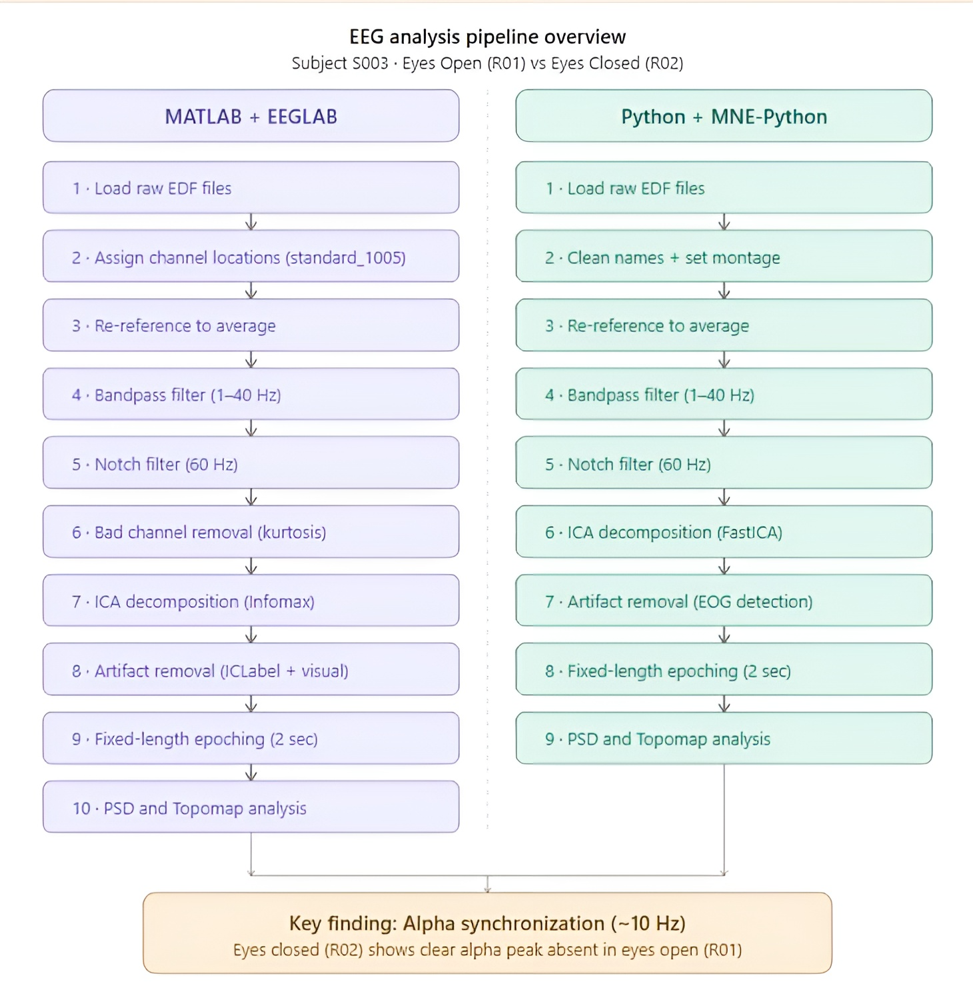
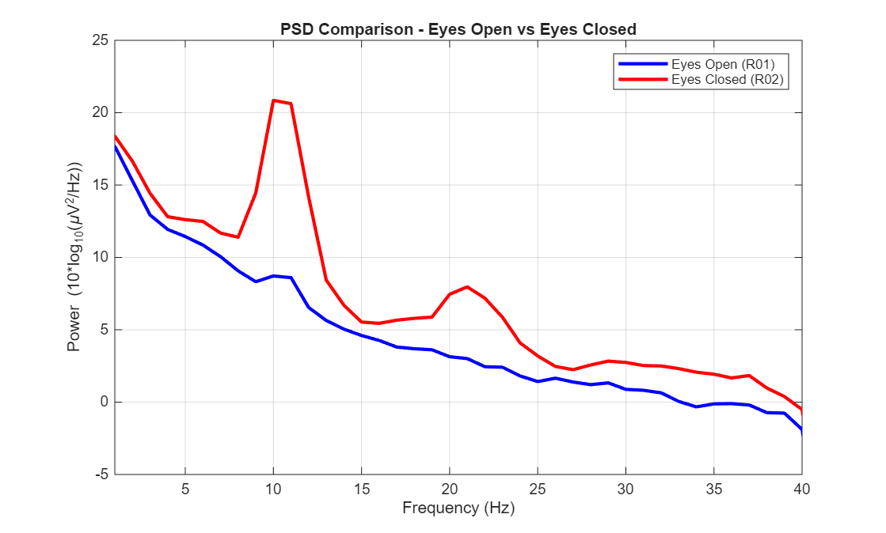
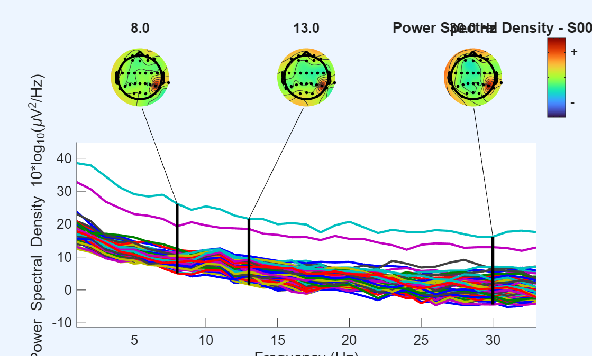
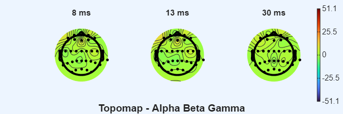
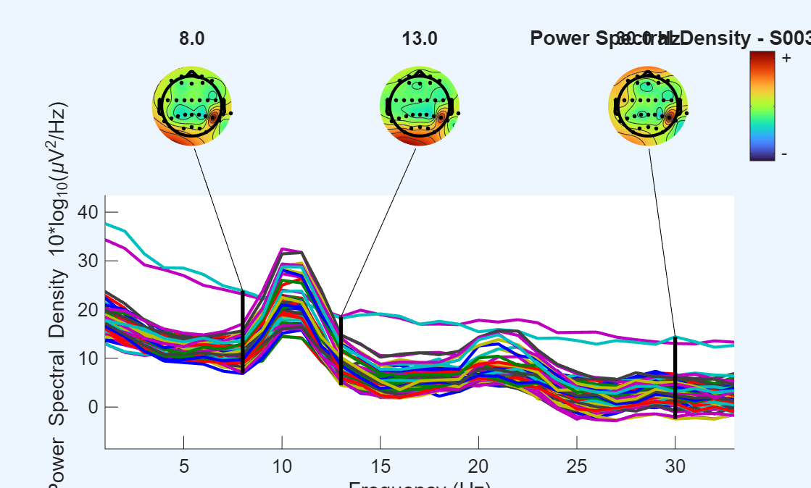
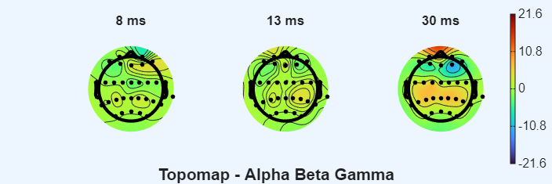
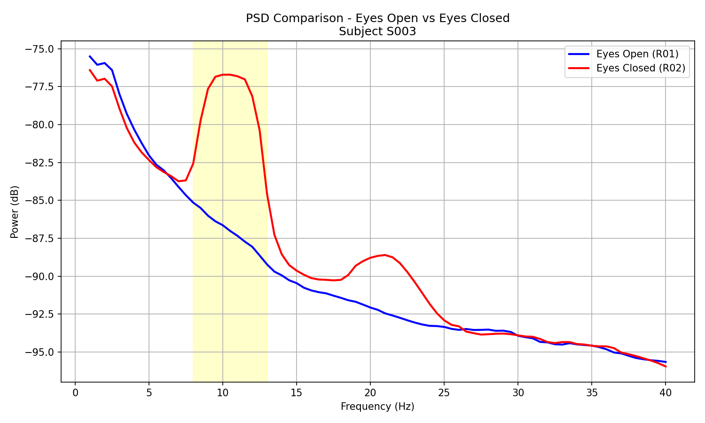
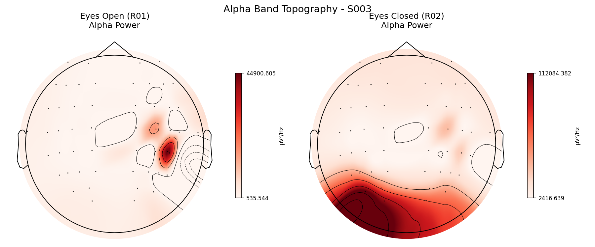

# EEG Signal Processing & Analysis

A complete EEG signal processing and analysis pipeline applied to resting-state data from the **PhysioNet EEG Motor Movement/Imagery Dataset**, implemented in both **MATLAB/EEGLAB** and **Python/MNE-Python**.

---

## Overview

This project compares brain activity between two resting-state conditions — eyes open and eyes closed — demonstrating the well-known **alpha synchronization** phenomenon (~10 Hz) using a full reproducible EEG pipeline.

**Subject:** S003 | **Conditions:** Eyes Open (R01) & Eyes Closed (R02)



---

## Key Finding

Alpha power (~10 Hz) is significantly higher during eyes closed compared to eyes open, consistent with established EEG literature on alpha synchronization.



---

## Dataset

**Name:** EEG Motor Movement/Imagery Dataset  
**Source:** PhysioNet  
**Link:** https://physionet.org/content/eegmmidb/1.0.0/  
**License:** PhysioNet Credentialed Health Data License

| Run | Condition | Status |
|-----|-----------|--------|
| R01 | Eyes Open Baseline | ✅ Analyzed |
| R02 | Eyes Closed Baseline | ✅ Analyzed |
| R03 | Motor Task | 🔄 Future Work |

---

## Pipeline

### MATLAB + EEGLAB

| Step | Script | Description |
|------|--------|-------------|
| 1 | `load_data_01.m` | Load raw EDF files (R01, R02, R03) |
| 2 | `preprocessing_R01_02.m` | R01: Re-reference, bandpass (1–40 Hz), notch (60 Hz), bad channel removal |
| 2 | `preprocessing_R02_02.m` | R02: Same preprocessing pipeline |
| 3 | `ICA_R01_03.m` | R01: Infomax ICA + ICLabel classification |
| 3 | `ICA_R02_03.m` | R02: Infomax ICA + ICLabel classification |
| 4 | `artifact_removal_R01_03.m` | R01: Remove artifact components |
| 4 | `artifact_removal_R02_03.m` | R02: Remove artifact components |
| 5 | `epoching_04.m` | R01 & R02: Fixed-length epoching (2s) |
| 6 | `analysis_05.m` | R01 & R02: PSD and Topomap visualization |
| 7 | `comparison_06.m` | PSD comparison: Eyes Open vs Eyes Closed |

### Python + MNE-Python

| Step | Description |
|------|-------------|
| Load | Read EDF files with MNE |
| Montage | Clean channel names + standard_1005 montage |
| Preprocess | Re-reference, bandpass (1–40 Hz), notch (60 Hz) |
| ICA | FastICA decomposition (20 components) |
| Artifact | Automated EOG detection and removal |
| Epoching | Fixed-length epochs (2s) |
| Analysis | PSD comparison + alpha band topomap |

---

## Results

### MATLAB Results

#### Eyes Open (R01)



#### Eyes Closed (R02)



### Python Results




---

## Project Structure

```
eeg-motor-movement-analysis/
│
├── README.md
├── LICENSE
├── .gitignore
│
├── data/
│   ├── raw/
│   │   ├── S003R01.edf    # Eyes Open Baseline
│   │   ├── S003R02.edf    # Eyes Closed Baseline
│   │   └── S003R03.edf    # Motor Task
│   └── processed/         # Preprocessed .set files
│
├── matlab_eeglab/
│   ├── scripts/
│   │   ├── load_data_01.m
│   │   ├── preprocessing_R01_02.m
│   │   ├── preprocessing_R02_02.m
│   │   ├── ICA_R01_03.m
│   │   ├── ICA_R02_03.m
│   │   ├── artifact_removal_R01_03.m
│   │   ├── artifact_removal_R02_03.m
│   │   ├── epoching_04.m
│   │   ├── analysis_05.m
│   │   └── comparison_06.m
│   └── results/
│       ├── figures/
│       └── reports/
│           └── report.md
│
├── python_mne/
│   ├── notebooks/
│   │   └── eeg_analysis.ipynb
│   ├── src/
│   │   ├── preprocessing.py
│   │   ├── analysis.py
│   │   └── visualization.py
│   ├── results/
│   │   └── figures/
│   └── requirements.txt
│
└── docs/
    └── pipeline_overview.png/md
```

---

## Tools & Requirements

### MATLAB
- MATLAB R2025a
- EEGLAB v2026.0.0
- Plugins: BIOSIG, dipfit, firfilt, ICLabel

### Python
- Python 3.14
- MNE-Python 1.12.1
- See `python_mne/requirements.txt`

---

## How to Run

### MATLAB
1. Clone the repository
2. Install EEGLAB v2026.0.0 and required plugins
3. Update file paths in each script to match your system
4. Run scripts in order (01 → 02 → 03 → 04 → 05 → 06)

### Python
1. Install dependencies: `pip install -r python_mne/requirements.txt`
2. Open `python_mne/notebooks/eeg_analysis.ipynb` in VS Code or Jupyter
3. Run all cells in order

---

## Future Work
- Analysis of Motor Task condition (R03) including Event-Related Desynchronization (ERD/ERS)

---

## References

- Schalk G (2009). EEG Motor Movement/Imagery Dataset (version 1.0.0). PhysioNet. https://doi.org/10.13026/C28G6P
- Delorme A, Makeig S (2004). EEGLAB: an open source toolbox for analysis of single-trial EEG dynamics. Journal of Neuroscience Methods, 134(1), 9-21. https://doi.org/10.1016/j.jneumeth.2003.10.009
- Pion-Tonachini L, Kreutz-Delgado K, Makeig S (2019). ICLabel: An automated electroencephalographic independent component classifier, dataset, and website. NeuroImage, 198, 181-197. https://doi.org/10.1016/j.neuroimage.2019.05.026
